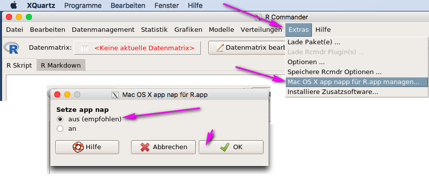

```{r setup, include=FALSE}
knitr::opts_chunk$set(echo = TRUE)
```

Bitten führen Sie alle Schritte in dieser Reihenfolge aus:

+ Aktualisieren Sie Ihr Betriebssystem - siehe  [mac Os Benutzerhandbuch](https://support.apple.com/de-de/HT201541)
+ Installieren Sie den Fenstermanager [XQuartz](https://www.xquartz.org/) und starten Sie Ihren Computer unbedingt neu
+ Installieren Sie die Programmiersprache [R](https://cran.r-project.org/bin/macosx/)
+ Starten Sie R, indem Sie die R.app ausführen
+ Installieren Sie den R Commander, indem Sie den Befehl `install.packages("Rcmdr")` eingeben und mit der Eingabetaste ausführen


Sobald der R Commander installiert ist, können Sie das Rcmdr-Paket mit dem Befehl `library(Rcmdr)` laden, um damit statistische Datenanalysen durchzuführen.

**Wichtig!**

Sie müssen Power Nap (im Engl. App Nap) unter macOS 10.9 oder später ausschalten, weil der R Commander sonst langsamer werden kann oder gelegentlich zögern wird, ein Menü anzuzeigen, je länger Ihre Sitzung fortschreitet. Dieses Verhalten ist darauf zurückzuführen, das Power Nap Energie spart, indem es in den "Nickerchen"-Modus geht, wenn das R.app-Fenster nicht sichtbar ist.

Sie können Power Nap entweder global ausschalten - siehe [macOS Benutzerhandbuch](https://support.apple.com/de-de/guide/mac-help/mh40774/mac) - oder über das Menü *Extras* im R Commander nur für die R.app (siehe Abbildung unten). 




